# myLifeSaver

`myLifeSaver` is a retirement financial modeling project designed to evaluate and compare different senior living options, specifically focusing on the financial impact of "Lifecare" (LC) vs. "Continuing Care" (CC) contracts in a community like Taylor Community. The project uses stochastic Monte Carlo simulations (via Latin Hypercube Sampling) and historical market data (e.g., SPY) to project future net worth, expenses, and the probability of outliving assets under various life expectancy and economic scenarios.

## Visualizations

### Run Many Results
These figures show the results of multiple scenario runs, typically comparing Lifecare benefit and net worth across different parameters.

- 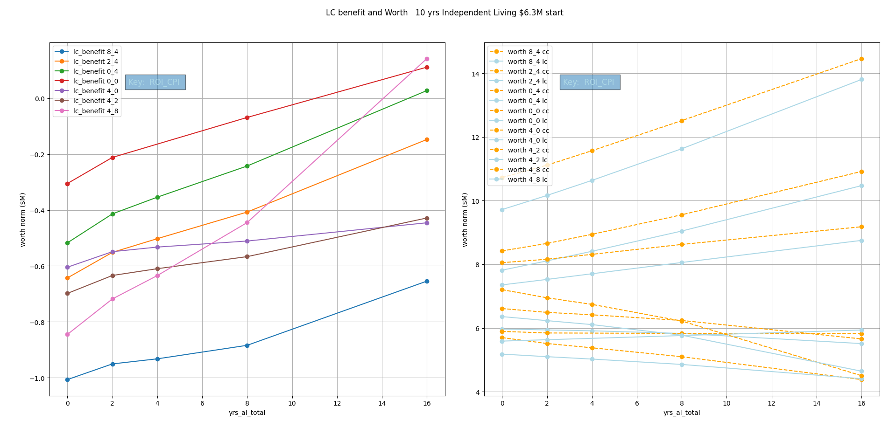
- 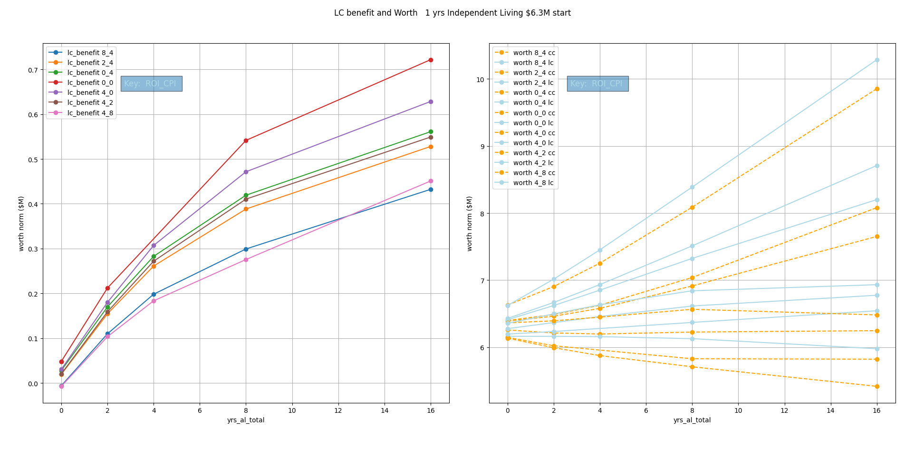
- 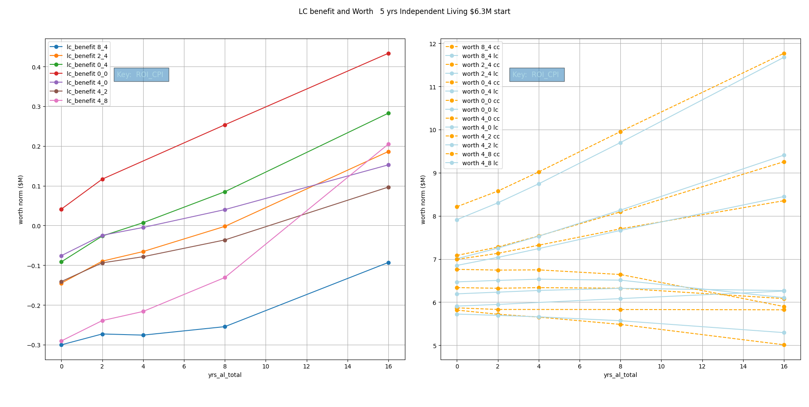

### Run LHS Gutz Results
Latin Hypercube Sampling analysis centered around the "Gutz" case inputs.

- 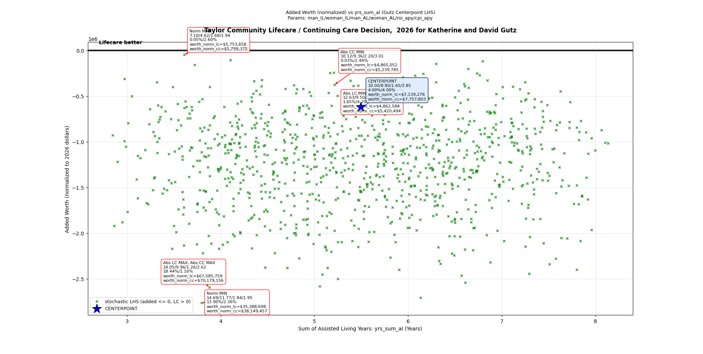
- 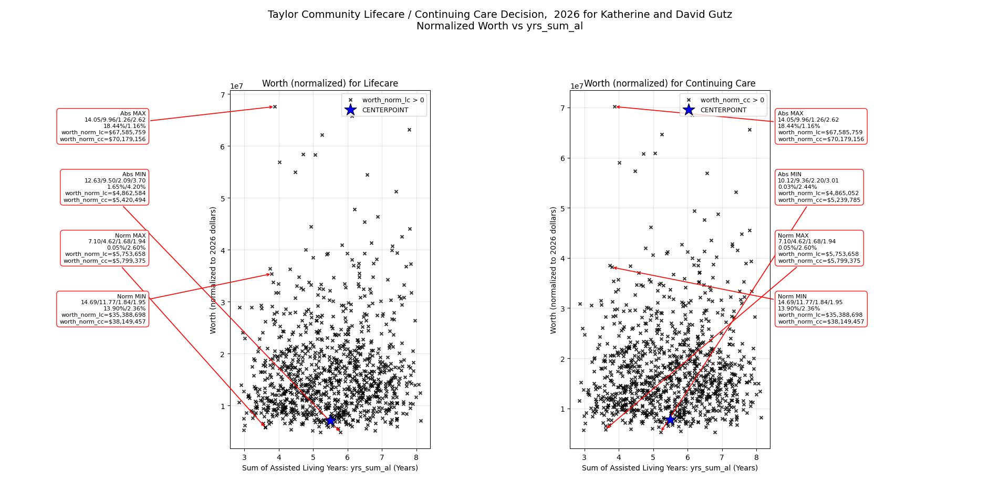
- 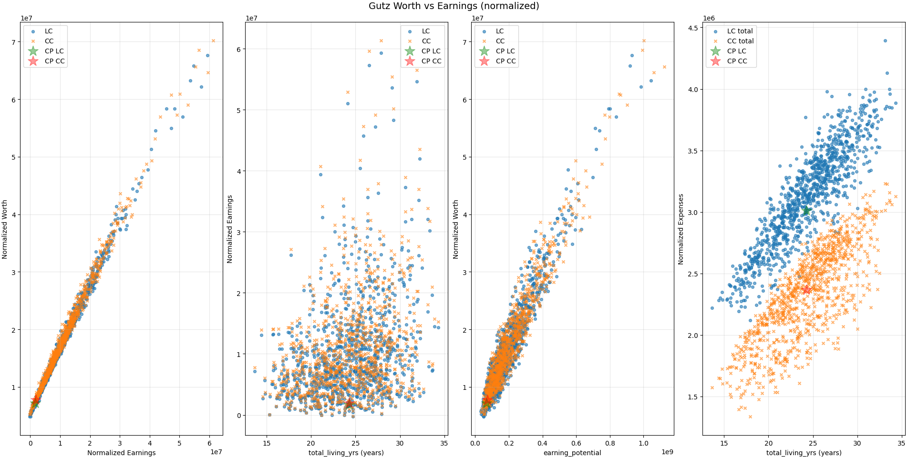
- 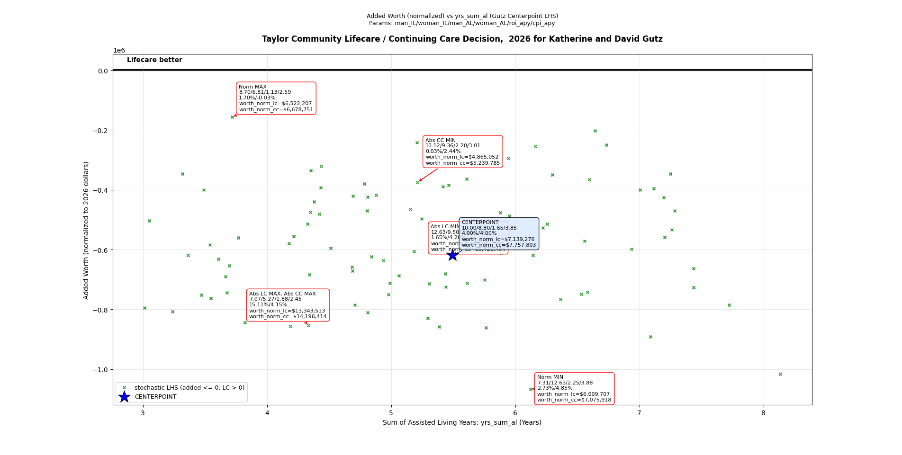
- 
- 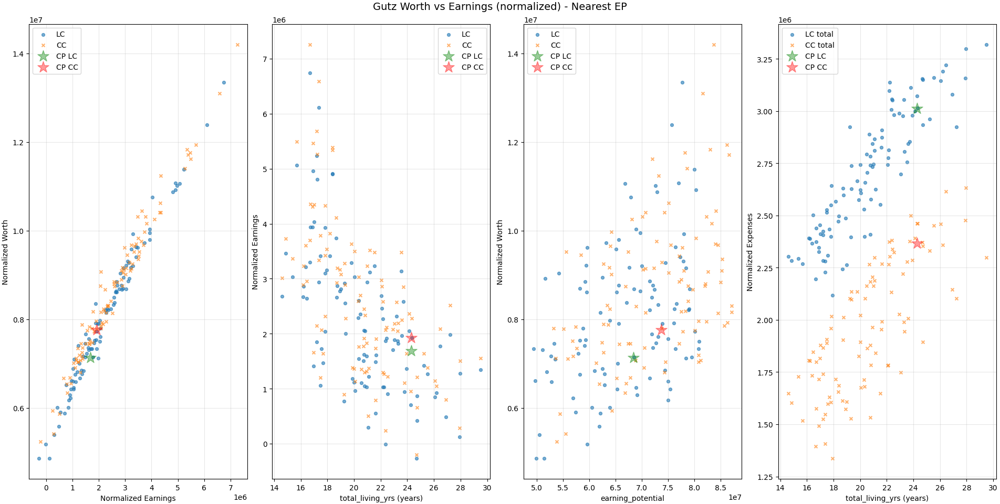
- 

### Run LHS Gutz+5 Results
LHS analysis centered around the Gutz case with an additional 5-year independent living buffer.

- 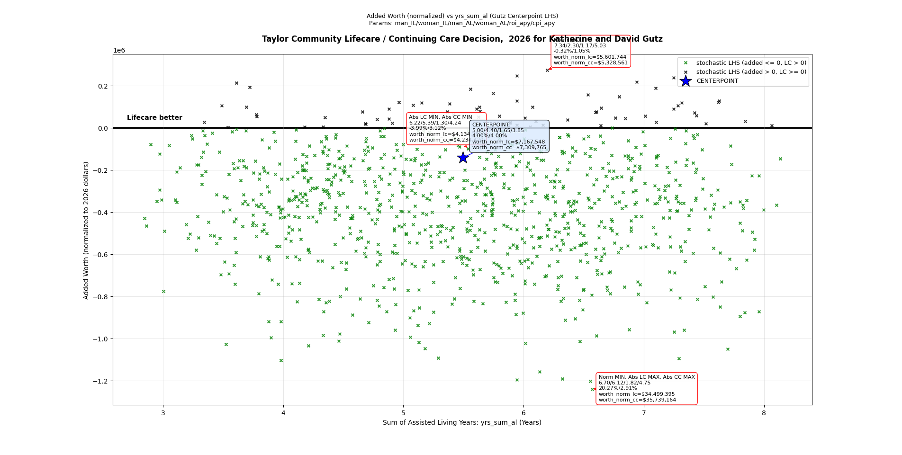
- 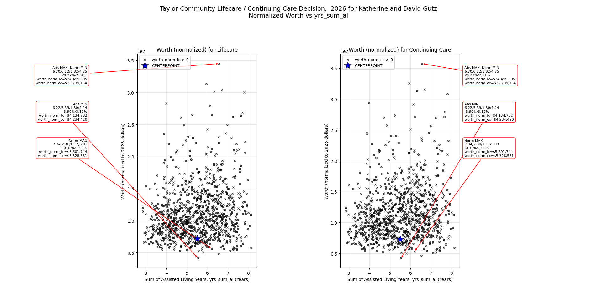
- 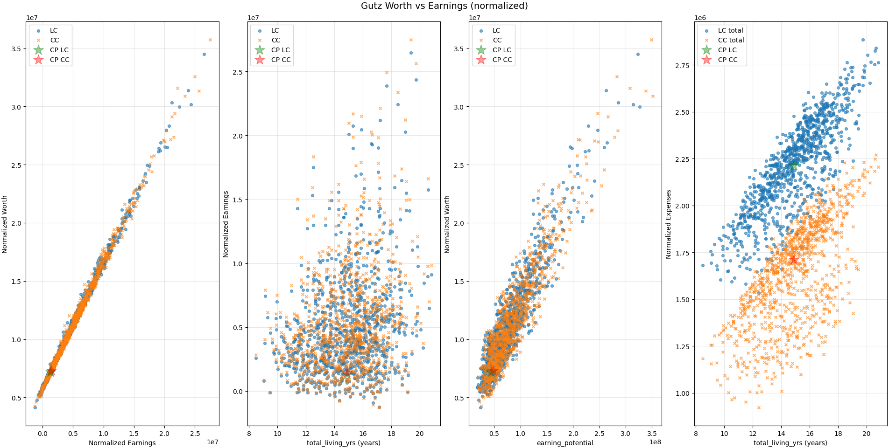
- 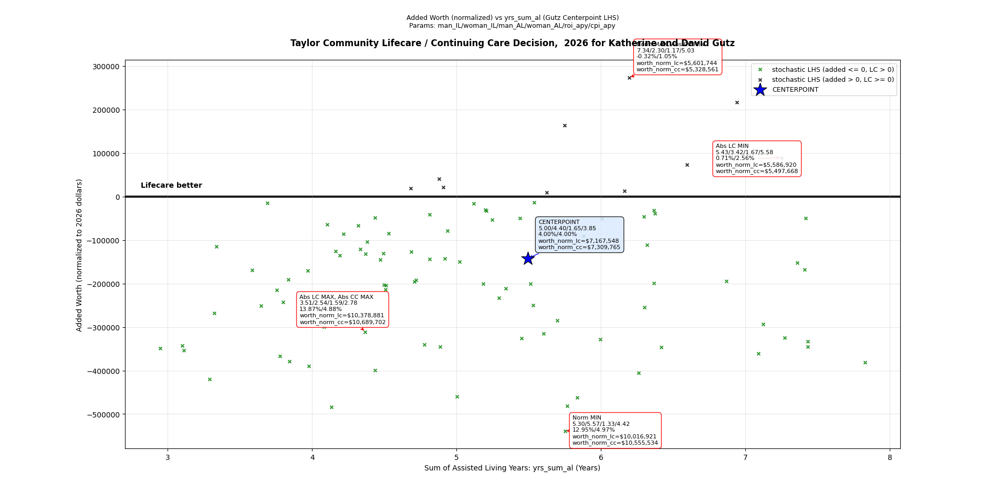
- 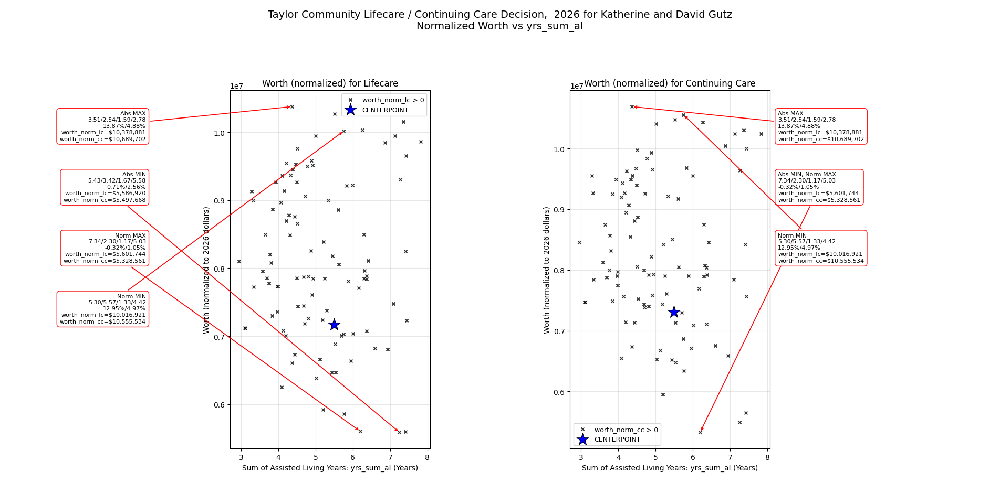
- 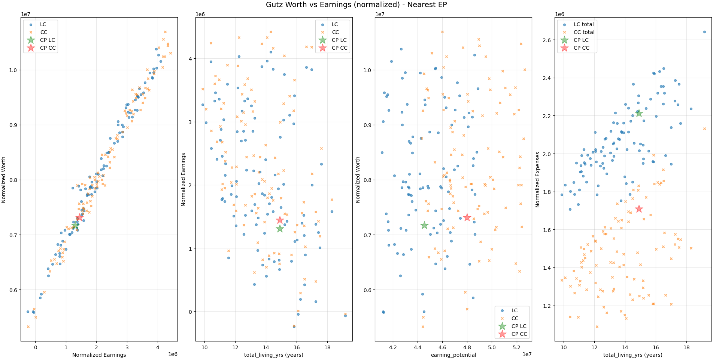

### Run LHS Results
Broad Latin Hypercube Sampling Monte Carlo analysis.

- 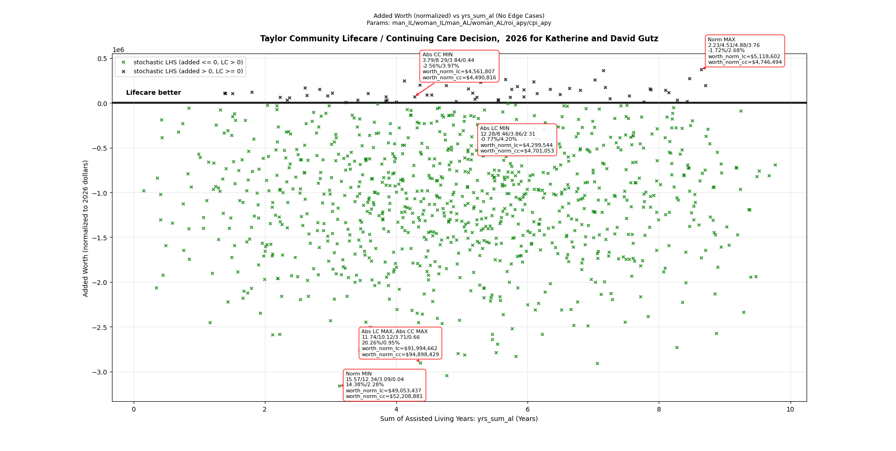
- 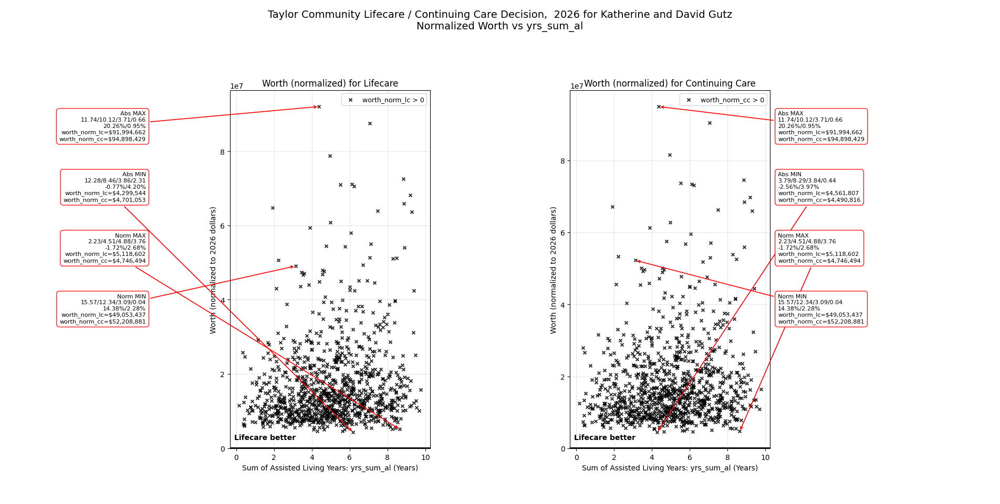
- 
- 
- 
- 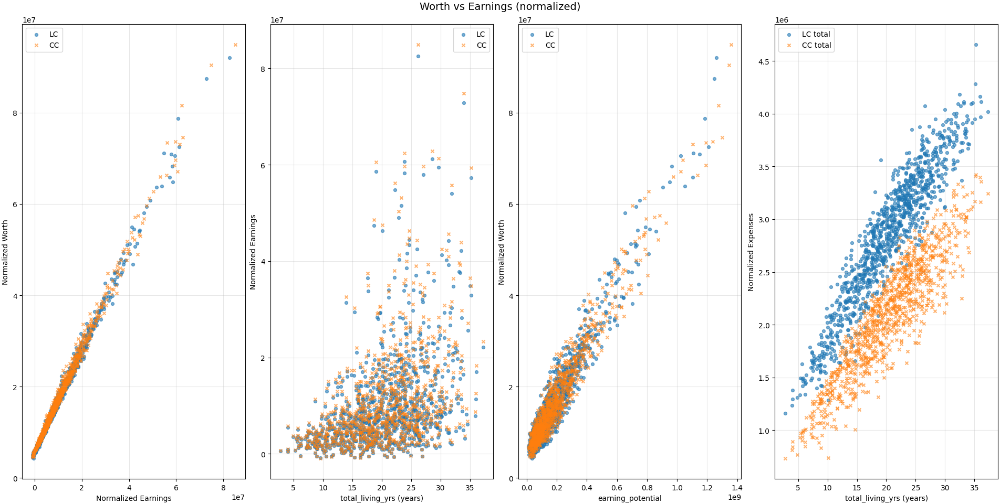

### Other Visualizations
(None currently available)

## Running Instructions

The simulation behavior is primarily controlled by the "User inputs" section at the top of each "Run" file. Below are the key configurations for each main entry point.

### `Run_many_Taylor.py`
```python
# User inputs
plots = True
printing_run = False
RUN_ONE_CASE_NAME: str | None = None  # e.g. "RUN_ONE_PRESENT" or "DEFAULT"
# RUN_ONE_CASE_NAME: str | None = 'RUN_ONE_PRESENT'  # e.g. "RUN_ONE_PRESENT" or "DEFAULT"
# yrs_il_man, yrs_il_woman = [15, 13.]
# yrs_il_man, yrs_il_woman = [10, 8.8]
# yrs_il_man, yrs_il_woman = [4, 2.]
# yrs_il_man, yrs_il_woman = [5, 4.4]
yrs_il_man, yrs_il_woman = [1, 0.4]
ins = [
    [0, 0, 8, 4],
    # [0.5, 0.5, 8, 4],
    [1, 1, 8, 4],
    [2, 2, 8, 4],
    [4, 4, 8, 4],
    [8, 8, 8, 4],
    # ... more scenarios ...
]
```

### `Run_LHS_Gutz_Taylor.py`
```python
# User inputs
#  To force the probability both man and woman go to AL instead of dying right away
force_al = False
plotting = True
LIFE_PARAM_VARIATION = 0.5 # For life parameters, use ±50% range around centerpoint (0.5)
DEFAULT_LHS_POINTS = 1000
ROI_MEAN_SHIFT_RANGE = (-0.005, 0.005)
ROI_VOL_MULTIPLIER_RANGE = (0.8, 1.2)
ROI_MEAN_REVERSION_RANGE = (0.1, 0.3)
```

### `Run_LHS_Gutz+5_Taylor.py`
```python
# User inputs
#  To force the probability both man and woman go to AL instead of dying right away
force_al = False
plotting = True
LIFE_PARAM_VARIATION = 0.5 # For life parameters, use ±50% range around centerpoint (0.5)
DEFAULT_LHS_POINTS = 1000
ROI_MEAN_SHIFT_RANGE = (-0.003, 0.003)
ROI_VOL_MULTIPLIER_RANGE = (0.8, 1.2)
ROI_MEAN_REVERSION_RANGE = (0.1, 0.3)
MAN_DOB = "1952-07-26"
WOMAN_DOB = "1951-04-11"
# MAN_INDEPENDENT_YRS_RANGE = (74.0 - age(START_CLOCK, MAN_DOB), 90.0 - age(START_CLOCK, MAN_DOB))
# WOMAN_INDEPENDENT_YRS_RANGE = (75.0 - age(START_CLOCK, WOMAN_DOB), 90.0 - age(START_CLOCK, WOMAN_DOB))

CENTERPOINT_MAN_INDEPENDENT_YRS = 5.
CENTERPOINT_WOMAN_INDEPENDENT_YRS = 4.4
```

### `Run_LHS_Taylor.py`
```python
# User inputs
force_al = False  #  To force the probability both man and woman go to AL instead of dying right away (False, True very special debug)
plotting = True
DEFAULT_LHS_POINTS = 1000  # will change seed values if not the same between runs
```

### `Run_one_Taylor.py`
```python
# User inputs
plot = False
FORCE_AL_CERTAINTY = True
# ROI_FIXED = None
ROI_FIXED = 4.
# CPI_FIXED = None
CPI_FIXED = 4.
RUN_ONE_CASE_NAME: str | None = None  # e.g. "RUN_ONE_PRESENT" or "DEFAULT"
# RUN_ONE_CASE_NAME: str | None = 'RUN_ONE_PRESENT'  # e.g. "RUN_ONE_PRESENT" or "DEFAULT"
```
